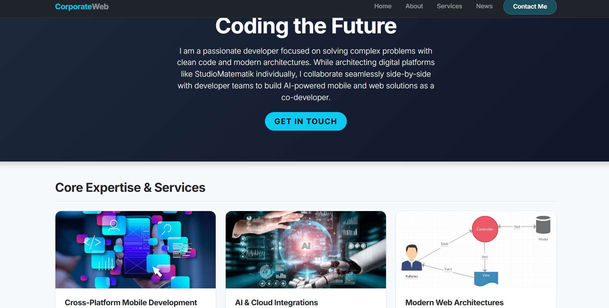
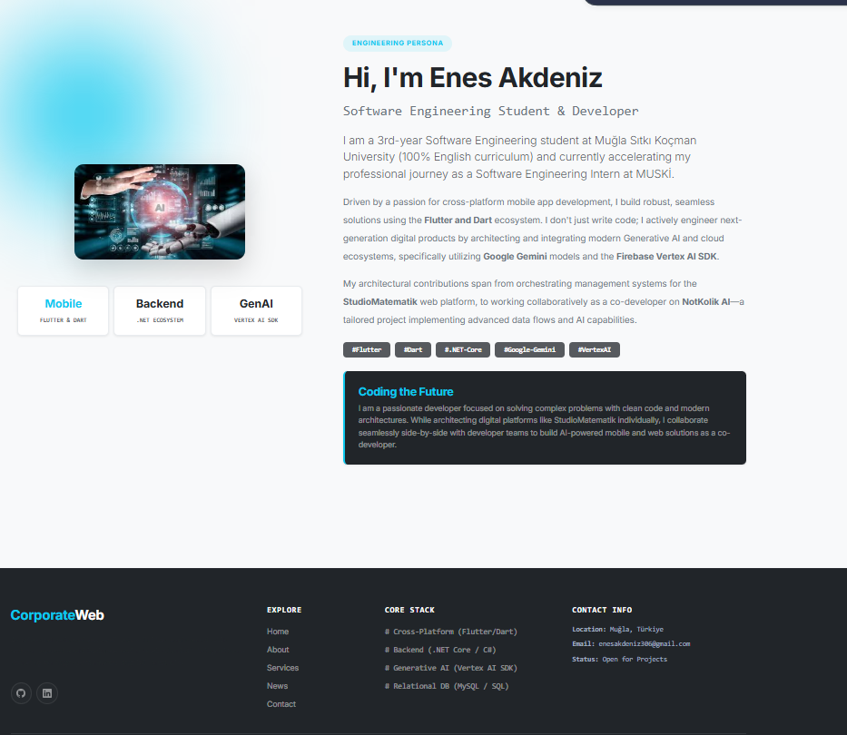
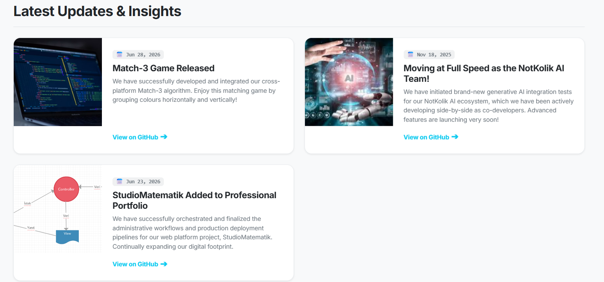
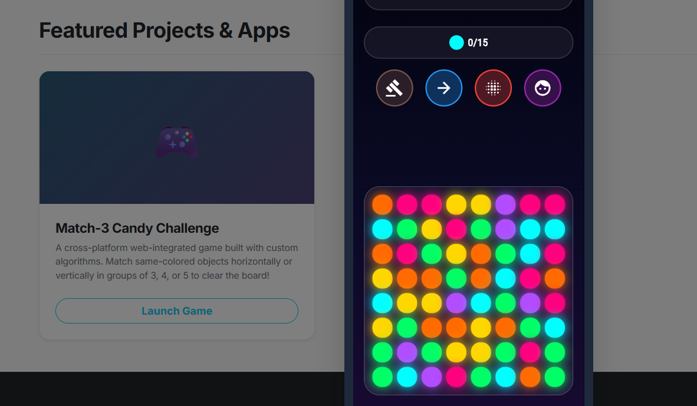
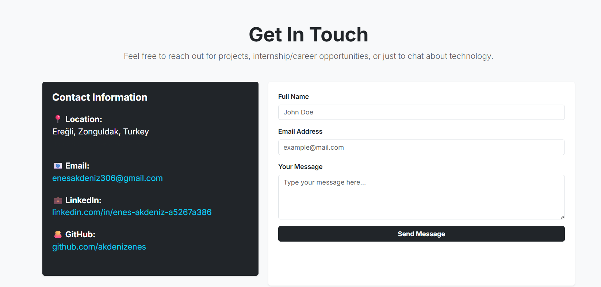
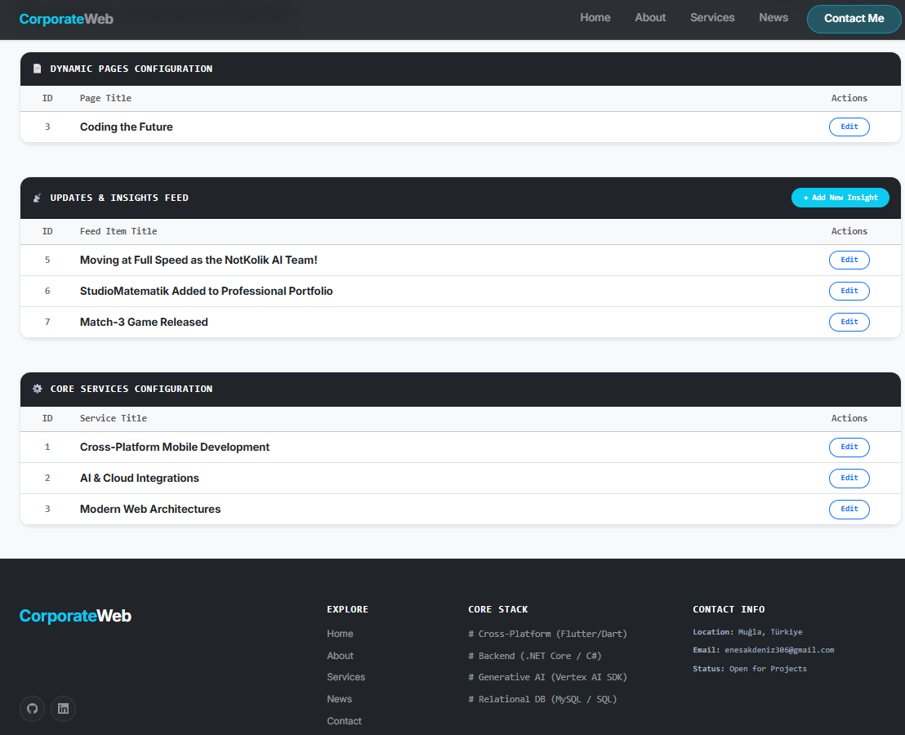

# CorporateWeb & Developer Portfolio 🚀

A dynamic, N-Tier architecture web application designed to serve as both a corporate platform and a comprehensive developer portfolio. It highlights core engineering skills, showcases featured projects, and includes a secure backend administration panel for real-time content management.

## ✨ Key Features & Previews

| Section | Preview |
| :--- | :--- |
| **Hero & Core Expertise**<br>A modern landing page emphasizing cross-platform mobile development, AI & Cloud integrations, and web architectures. |  |
| **About Me / Persona**<br>Detailed professional background, highlighting the Flutter/Dart ecosystem, .NET Core, and Vertex AI SDK utilization. |  |
| **Latest Updates & Insights**<br>A dynamic feed displaying recent releases (like the Match-3 algorithm) and ecosystem integrations. |  |
| **Featured Projects**<br>Interactive app showcases, featuring custom-built algorithms and digital platforms. |  |
| **Contact & Integration**<br>A fully functional contact form with secure SMTP credentials, routing messages directly from the UI. |  |
| **Admin Dashboard**<br>A secure, authenticated control panel to manage dynamic pages, update feeds, and configure core services. |  |

## 🛠️ Technology Stack

*   **Backend:** C#, ASP.NET Core (.NET 9)
*   **Database & ORM:** MySQL, Entity Framework Core
*   **Architecture:** N-Tier (Business, DataAccess, Entities, WebUI)
*   **Frontend:** HTML5, CSS3, Bootstrap (Responsive Design)
*   **Scripts:** Python (for environment setup and UI management)

## 📂 Project Structure

*   `CorporateWeb.Entities`: Database models and entities.
*   `CorporateWeb.DataAccess`: Context and repository implementations for CRUD operations.
*   `CorporateWeb.Business`: Business logic, service interfaces, and validation rules.
*   `CorporateWeb.WebUI`: Controllers, Views, and user interface.
*   `arayuz.py` & `kurulum.py`: Custom Python scripts for seamless deployment and configuration.

## ⚙️ Getting Started

1.  **Clone the repository:**
    ```bash
    git clone https://github.com/akdenizenes/CorporateWeb.git https://github.com/akdenizenes/CorporateWeb.git
    cd CorporateWeb
    ```
2.  **Restore dependencies:**
    ```bash
    dotnet restore
    ```
3.  **Database Configuration:**
    Update your connection string and SMTP credentials in the `appsettings.json` file inside the `WebUI` project. Then, apply migrations:
    ```bash
    dotnet ef database update
    ```
4.  **Run the application:**
    ```bash
    cd CorporateWeb.WebUI
    dotnet run
    ```
